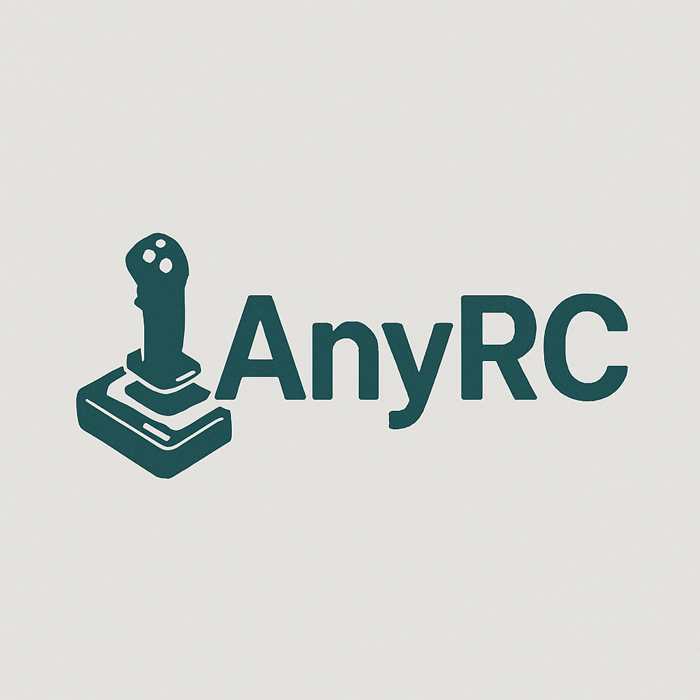

<p align="center">
  
</p>

# AnyRC

## About The Project
AnyRC is an innovative remote control simulation platform that enables realistic RC vehicle modeling and testing. This project focuses on creating highly accurate and customizable RC vehicle simulations for hobbyists, developers, and researchers.

## Project Vision
Our goal is to provide the RC community with a powerful simulation tool that bridges the gap between virtual testing and real-world RC vehicle operation.

## Getting Started

### Prerequisites
- Windows 10 or later
- Python 3.8+
- DirectX 11 compatible graphics card

### Installation
1. Clone the repository
```bash
git clone https://github.com/yourusername/AnyRC.git
```
2. Install required dependencies
```bash
pip install -r requirements.txt
```

## Usage
1. Launch the application
2. Select or create a vehicle model
3. Configure simulation parameters
4. Start the simulation

## Features
- Realistic physics engine
- Customizable vehicle parameters
- Real-time simulation
- Multiple camera views
- Data logging and analysis

## Contributing
We welcome contributions from the community. Please read our contribution guidelines before submitting pull requests.

## Authors

### Lead Developer
- **Nadav**
  - Project architect and RC simulation specialist
  - Core physics engine development
  - Contact: nadav@anyrc.dev

### AI Assistant
- **GitHub Copilot**
  - Code enhancement and documentation support
  - Technical writing assistance
  - Architecture recommendations

## Project Status
This project is actively under development. We welcome feedback and suggestions for improvement.

## License
This project is licensed under the MIT License - see the LICENSE.md file for details.

## Acknowledgments
- Thanks to all contributors
- Special thanks to the RC community for feedback and support
